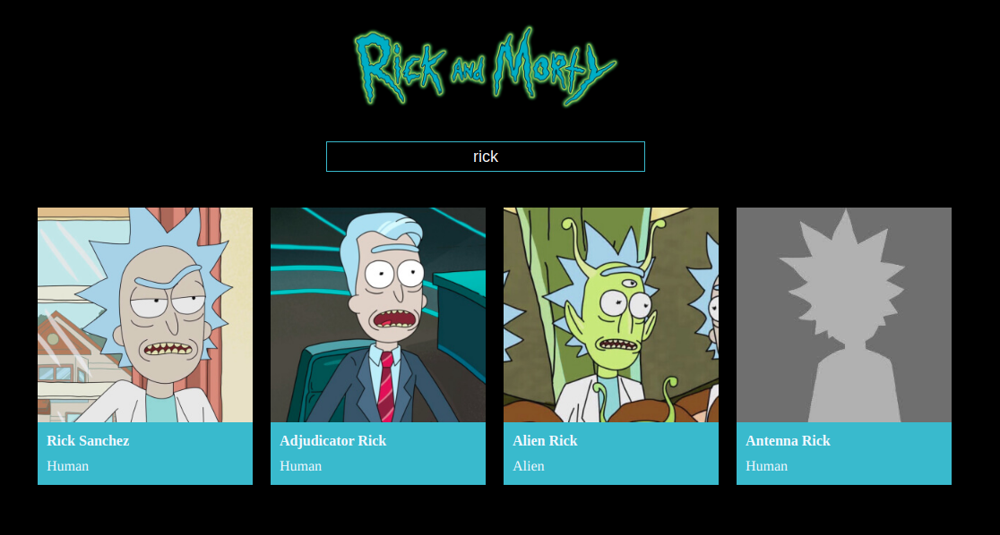

# Rick and Morty Characters

This project is useful to search of Rick and Morty characters.
This application has two screen:

- **Character List**: Shows a list with all characters and you can look for a specified character using the filter component.
- **Character Card**: Shows the character card with all details.

## Used libraries:

- [React](https://es.reactjs.org/)
- [React Router](https://reactrouter.com/)

## Available Scripts

In the project directory, you can run:

### `npm start`

Runs the app in the development mode.\
Open [http://localhost:3000](http://localhost:3000) to view it in your browser.

The page will reload when you make changes.\
You may also see any lint errors in the console.

### `npm run docs`

Builds the app for production using the `build` script and moves the generated files to the `/docs` folder.

### `npm run build`

Builds the app for production to the `build` folder.\
It correctly bundles React in production mode and optimizes the build for the best performance.

The build is minified and the filenames include the hashes.\
Your app is ready to be deployed!

See the section about [deployment](https://facebook.github.io/create-react-app/docs/deployment) for more information.
